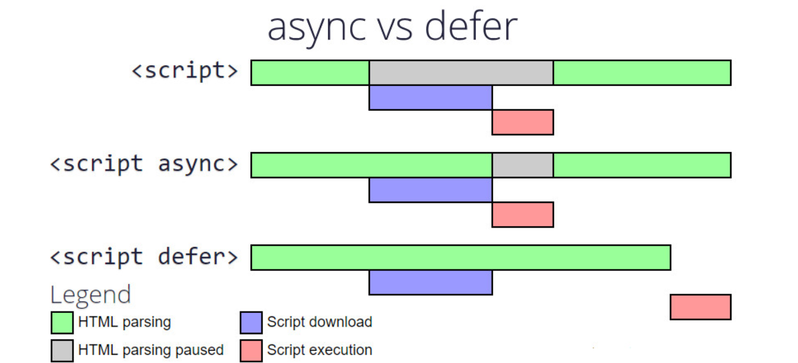
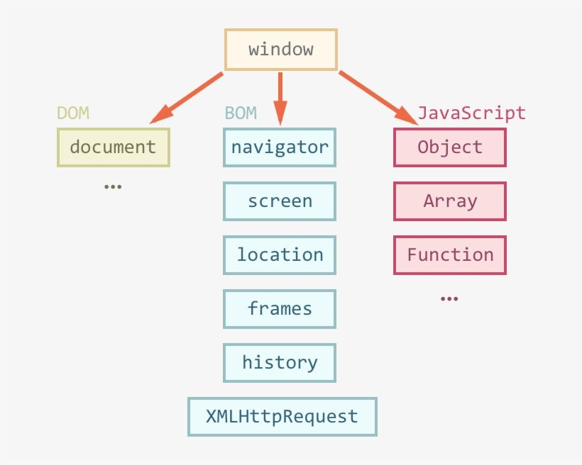

# Как использовать JavaScript в HTML

### Первое знакомство

JavaScript обычно используется вместе с HTML.
HTML отвечает за **структуру** страницы (текст, кнопки, картинки), CSS - за **внешний вид**, а JS - за **логику**: обработку событий, изменения на странице, работу с сервером.


### Подключение через тег `<script>`

Самый простой способ подключить JS — написать код прямо в HTML внутри тега `<script>`.

```html
<!DOCTYPE html>
<html>
<head>
  <title>Мой сайт</title>
</head>
<body>
  <h1>Привет, мир!</h1>
  
  <script>
    console.log("это сообщение появится в консоли браузера")
  </script>
</body>
</html>
```

* Код внутри `<script>` выполняется сразу при загрузке страницы.
* Всё, что мы пишем, попадает в общий JavaScript-контекст браузера.


### Подключение внешнего файла

Обычно код пишут не в самом HTML, а в отдельном `.js`-файле.

```html
<!DOCTYPE html>
<html lang="ru">
<head>
  <title>Мой сайт</title>
  <script src="script.js"></script>
</head>
<body>
  <h1>Привет, мир!</h1>
</body>
</html>
```

Файл `script.js`:

```javascript
console.log("Привет из script.js!")
```

Так код становится чище и его проще поддерживать.

### Где лучше подключать скрипты

Есть два основных варианта:

1. В `<head>` \
   Код выполняется ещё до загрузки всей страницы. Если в скрипте обращение к элементам страницы, они могут быть недоступны.

   ```html
   <head>
     <script src="script.js"></script>
   </head>
   ```

2. Внизу `<body>` \
   Страница сначала загружается, потом выполняется скрипт. Это надёжнее.

   ```html
   <body>
     <h1>Заголовок</h1>
     <script src="script.js"></script>
   </body>
   ```

Рекомендация: **ставить скрипты внизу** или использовать специальные атрибуты.

 

### Атрибуты defer и async

Чтобы не блокировать загрузку страницы, можно подключать скрипты с атрибутами:

* `defer` - выполнить скрипт после полной загрузки HTML.

  ```html
  <script src="script.js" defer></script>
  ```

  Выполнение строго по порядку, как указано в HTML.

* `async` - выполнить скрипт как только он загрузился (порядок не гарантируется).

  ```html
  <script src="script.js" async></script>
  ```




# Объект `window` в JavaScript

### Что это вообще такое

Когда мы пишем JS в браузере, всё выполняется внутри окружения страницы.
Главный объект этого окружения называется **`window`**.

* `window` - это глобальный объект в браузере.
* У него есть свойства и методы для работы с самим окном браузера, документом внутри него, хранилищем, событиями, таймерами и многим другим.
* В глобальной области видимости все переменные и функции фактически становятся свойствами объекта `window`.

Пример:

```javascript
function a1(){
    return "hello"
}
console.log(window.a1()) // hello
```


### Связь с `document`

Одно из самых важных свойств `window` - это `document`.
Через него мы получаем доступ к DOM (структуре HTML-страницы).

```javascript
console.log(window.document) // выводит объект документа
```

Обычно мы пишем просто `document`, но это то же самое, что `window.document`.

На картинке ниже в общих чертах показано, что доступно для JavaScript в браузерном окружении:




### Размеры окна

У объекта `window` есть свойства, чтобы узнать размеры окна браузера:

```javascript
console.log(window.innerWidth)  // ширина области внутри окна
console.log(window.innerHeight) // высота
```

Можно использовать, чтобы подстраивать интерфейс под размер экрана.

 

### Методы управления окном

Некоторые методы `window` напрямую управляют окном браузера (работают не во всех современных браузерах, потому что это может мешать пользователю):

```javascript
window.open("https://example.com", "_blank") // открыть новое окно/вкладку
window.close()                               // закрыть текущее окно
window.moveTo(100, 100)                      // переместить окно (не всегда сработает)
window.resizeTo(800, 600)                    // изменить размер
```


Пример рабочей программы:

```html
<!DOCTYPE html>
<html lang="en">
<head>
    <meta charset="UTF-8">
    <title>Test</title>
</head>
<body></body>
<script>
    setTimeout(() => {
        console.log("hello")
        setTimeout(() => {
            window.close()
        }, 1000)
    }, 3000)
</script>
</html>
```
 

### Диалоговые окна

У `window` есть встроенные методы для простых диалогов:

```javascript
alert("Сообщение")        // простое уведомление
const res = confirm("Вы уверены?") // возвращает true/false
const name = prompt("Введите имя:") // ввод текста
```

Пример:

```javascript
if (confirm("Удалить запись?")) {
  alert("Удалено!")
} else {
  alert("Отменено")
}
```

### Таймеры

Таймеры (`setTimeout`, `setInterval`) тоже находятся внутри `window`.

```javascript
setTimeout(() => console.log("через секунду"), 1000)

let id = setInterval(() => console.log("каждую секунду"), 1000)
setTimeout(() => clearInterval(id), 5000) // остановить через 5 секунд
```

В глобальном контексте можно писать без `window.`, но на самом деле это:

```javascript
window.setTimeout(...)
window.setInterval(...)
```

 

### Навигация

Через `window.location` можно управлять адресной строкой:

```javascript
console.log(window.location.href) // полный URL
window.location.href = "https://google.com" // переход на другую страницу
```

 

### История

Через `window.history` можно управлять историей браузера:

```javascript
history.back()  // вернуться назад
history.forward() // вперёд
history.go(-2)  // на 2 шага назад
```

 

### События окна

На `window` вешают события, связанные с самим окном или страницей:

```javascript
window.addEventListener("resize", () => {
  console.log("Окно изменено")
})

window.addEventListener("scroll", () => {
  console.log("Страница прокручена")
})

window.addEventListener("load", () => {
  console.log("Страница загружена")
})
```

 

### Глобальные переменные и `window`

Все переменные и функции, объявленные через `var` в глобальной области, становятся свойствами `window`.

```javascript
var x = 42
console.log(window.x) // 42

function hello() {
  console.log("hi")
}
window.hello() // "hi"
```

⚠️ Но если объявить через `let` или `const`, то они не попадут в `window`:

```javascript
let y = 5
console.log(window.y) // undefined
```

 

### Локальное хранилище

Через `window` доступно локальное и сессионное хранилище:

```javascript
localStorage.setItem("user", "Alice")
console.log(localStorage.getItem("user")) // Alice

sessionStorage.setItem("id", "123")
console.log(sessionStorage.getItem("id")) // 123
```

Разница:

* `localStorage` сохраняется даже после закрытия вкладки.
* `sessionStorage` очищается, как только вкладка закрывается.


### Взаимодействие с HTML

Через JS мы можем менять элементы страницы.
Для этого нужно сначала «найти» элемент.

Пример:

```html
<body>
  <h1 id="title">Привет</h1>
  <button id="btn">Изменить текст</button>

  <script>
    const title = document.getElementById("title")
    const btn = document.getElementById("btn")

    btn.onclick = () => {
      title.textContent = "Текст изменён!"
    }
  </script>
</body>
```

* `document.getElementById` — находит элемент по id.
* `onclick` — обработчик клика.
* `textContent` — меняет текст внутри тега.

 

### Обработчики событий

Можно вешать обработчики напрямую в HTML:

```html
<button onclick="alert('Привет!')">Нажми</button>
```

Но это считается устаревшим. Лучше через JS:

```javascript
btn.addEventListener("click", () => alert("Привет!"))
```

Преимущество — можно добавлять несколько обработчиков к одному элементу.

 

### Пример с формой

```html
<body>
  <form id="myForm">
    <input type="text" id="name" placeholder="Введите имя">
    <button type="submit">Отправить</button>
  </form>

  <script>
    const form = document.getElementById("myForm")

    form.addEventListener("submit", (event) => {
      event.preventDefault() // чтобы страница не перезагружалась
      const name = document.getElementById("name").value
      alert("Привет, " + name + "!")
    })
  </script>
</body>
```

# Мини-гайд: взаимодействие с HTML через JavaScript

### Поиск элементов в DOM

Основные методы:

```javascript
// поиск по id
const el1 = document.getElementById("myId")

// поиск по имени тега
const el2 = document.getElementsByTagName("div") // коллекция

// поиск по имени класса
const el3 = document.getElementsByClassName("myClass") // коллекция

// поиск по CSS-селектору (первый элемент)
const el4 = document.querySelector(".myClass")

// поиск по CSS-селектору (все элементы)
const el5 = document.querySelectorAll("div.myClass")
```

---

### Изменение текста и HTML

Есть два основных способа менять содержимое элемента:

```html
<h1 id="title">Старый текст</h1>
```

```javascript
const title = document.getElementById("title")

// только текст
title.textContent = "Новый текст"

// вставка HTML
title.innerHTML = "<span style='color:red'>Красный текст</span>"
```

⚠️ Использовать `innerHTML` аккуратно, т.к. там может быть небезопасный код.


### Изменение атрибутов

```html

```

```javascript
const logo = document.getElementById("logo")

// Получить атрибут
console.log(logo.getAttribute("src")) // old.png

// Изменить атрибут
logo.setAttribute("src", "new.png")

// Удалить атрибут
logo.removeAttribute("alt")
```


### Работа с классами

```html
<p id="text" class="highlight">Привет</p>
```

```javascript
const text = document.getElementById("text")

// добавить класс
text.classList.add("big")

// yдалить класс
text.classList.remove("highlight")

// переключить (если есть - убрать, если нет - добавить)
text.classList.toggle("active")

// проверить наличие
console.log(text.classList.contains("active"))
```


### Изменение стилей

```javascript
text.style.color = "blue"
text.style.fontSize = "24px"
```

Лучше менять классы, чем напрямую писать стили.

### Создание и добавление новых элементов

```javascript
const newDiv = document.createElement("div")
newDiv.textContent = "Я новый div!"

// добавить в конец body
document.body.appendChild(newDiv)

// добавить внутрь другого элемента
const container = document.getElementById("container")
container.appendChild(newDiv)
```

Можно вставлять не только в конец, но и в начало или в конкретное место:

```javascript
container.prepend(newDiv) // в начало
container.before(newDiv) // перед контейнером
container.after(newDiv) // после контейнера
```


### Удаление элементов

```javascript
const el = document.getElementById("removeMe")
el.remove() // убирает элемент из DOM
```


### События

```html
<button id="btn">Нажми</button>
```

```javascript
const btn = document.getElementById("btn")

btn.addEventListener("click", () => {
  alert("Кнопка нажата")
})
```


### Пример: создаём список по клику

```html
<button id="add">Добавить пункт</button>
<ul id="list"></ul>
```

```javascript
const list = document.getElementById("list")
const btn = document.getElementById("add")

btn.addEventListener("click", () => {
  const li = document.createElement("li")
  li.textContent = "Новый пункт"
  list.appendChild(li)
})
```

