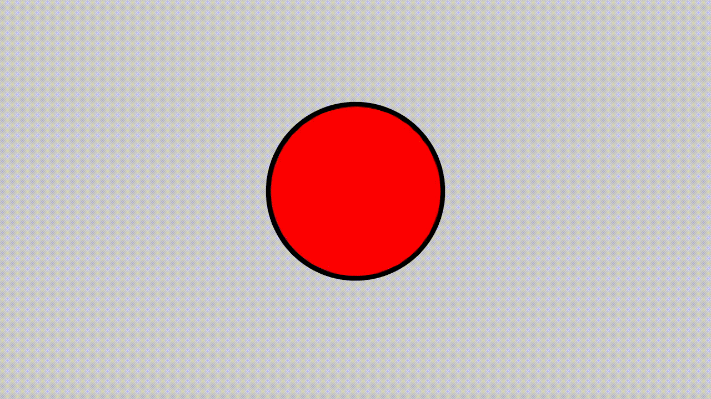

### Вариант = (№ в БРС mod 3) + 1


# Вариант №1

## Задание на верстку



## Задание на работу с объектами в js

* Функция-конструктор **`Animal(name)`**:

    * свойства: `this.name`, `this.hunger = 0`
    * методы через `Animal.prototype`:

        * `increaseHunger()` — + случайное 1–10
        * `feed()` — hunger=0
* Конструкторы-наследники:

    * **`Cow(name)`**, **`Sheep(name)`**
    * должны использовать `Animal.call(this, name)` и унаследовать прототип
    * переопределяют `feed()`: сначала вызвать родительский, потом лог «Мууу!» / «Беее!»
* Функция-конструктор **`Farm()`**:

    * поле `this.animals = []`
    * методы:

        * `addAnimal(animal)`
        * `startLife()` (через `setInterval` каждые 2с)
        * `stopLife()`


## Пример работы

```js
const farm = new Farm();
farm.addAnimal(new Cow("Бурёнка"));
farm.addAnimal(new Sheep("Долли"));

farm.startLife();

setTimeout(() => {
  if (farm.animals[0]) farm.animals[0].feed();
}, 5000);

setTimeout(() => farm.stopLife(), 14000);
```


#  Вариант №2

## Задание на верстку


## Задание на работу с объектами в js

* **`Client(name, balance)`**:

    * методы: `deposit(amount)`, `withdraw(amount)`
* **`VIPClient(name, balance)`**:

    * наследует от Client
    * переопределяет `deposit(amount)` → добавляет бонус `10%` (округлять вниз)
* **`Bank()`**:

    * хранит `this.clients = []`
    * методы: `addClient`, `startInterest(rate)`, `stopInterest`


## Пример работы

```js
const bank = new Bank();
bank.addClient(new Client("Аня", 100));
bank.addClient(new VIPClient("Игорь", 200));

bank.startInterest(5);

setTimeout(() => bank.clients[0].deposit(50), 2000);
setTimeout(() => bank.clients[1].withdraw(250), 5000);
setTimeout(() => bank.stopInterest(), 12000);
```


# Вариант №3

## Задание на верстку


## Задание на работу с объектами в js 

* **`Warrior(name, hp=100)`**:

    * методы: `attack()` → случай 1..20, `takeDamage(dmg)`, `isAlive()`
* **`Knight(name, hp)`**:

    * наследует Warrior
    * переопределяет `takeDamage(dmg)` → урон уменьшается до `Math.floor(dmg*0.7)`
* **`Archer(name, hp)`**:

    * наследует Warrior
    * переопределяет `attack()` → 30% шанс критического (x2)
* **`Arena()`**:

    * хранит `warriors = []`
    * `addWarrior(w)`, `startBattle()`, `stopBattle()`


### Пример работы

```js
const arena = new Arena();
arena.addWarrior(new Knight("Гром"));
arena.addWarrior(new Archer("Тень"));
arena.addWarrior(new Warrior("Вихрь"));

arena.startBattle();

setTimeout(() => arena.stopBattle(), 20000);
```
