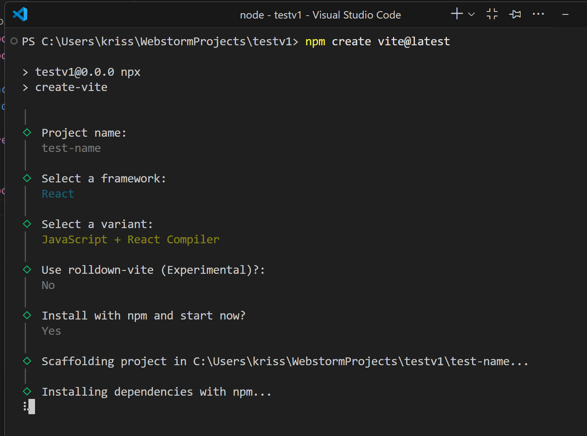
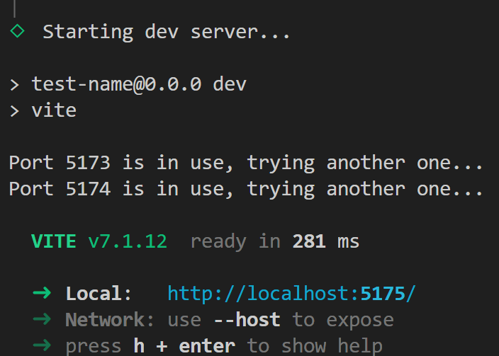

### 1. Создать проект

```
npm create vite@latest
```




### 2. Запуск в режиме разработчика

```
npm run dev 
```




### 3. Билд проекта

```
npm run build
```

### Пример

[/example](./example)

### Захостить

https://pages.github.com/